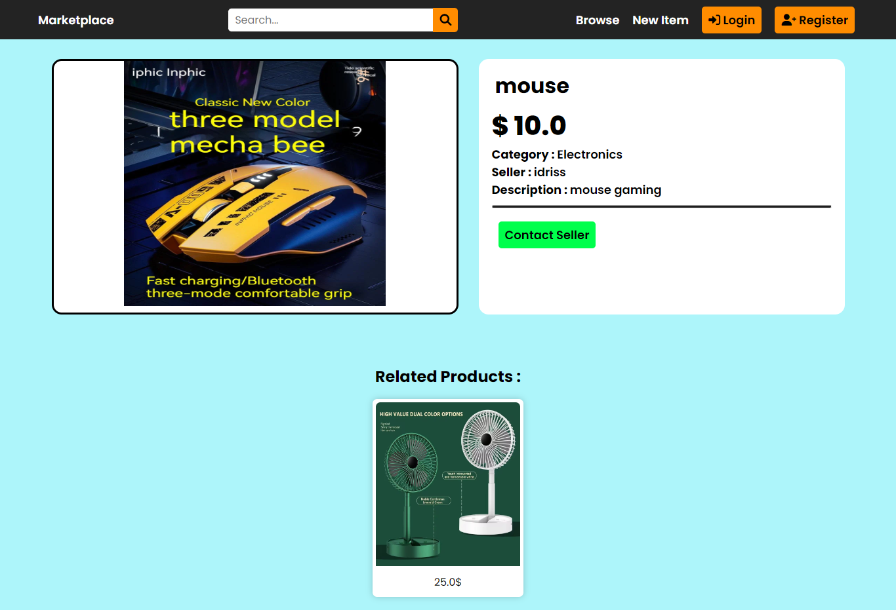

# Django Marketplace App

This Repo contains a simple "Marketplace" application developed using the Django Framework.

this is a example image of the Main page and the Product page : 




## Application Features :

### 1. **User Authentication and Profiles**
   - **User Registration and Login**: Allow users to sign up, log in, and manage their accounts.

   

   - **Profile Management**: Users can be able to edit their profiles.

     

### 2. **Product Management**
   - **Product Listings**: Sellers can create, update, and delete their product listings.

     
     
   - **Product Categories**: Organize products into categories and subcategories for easier browsing.

### 3. **Search and Filtering**
   - **Search Bar**: Enable users to search for products by keywords.
   - **Filters by Categories**: Filter products by categories.

  

### 4. **Seller Management**
   - **Seller Dashboard**: Sellers can manage their listings, view sales, and track performance.

  

### 5. **Messaging System**
   - **Buyer-Seller Communication**: Enable direct messaging between buyers and sellers.

 

## Upcoming Features :

### **Shopping Cart and Checkout**
   - **Add to Cart**: Allow users to add products to a shopping cart for later purchase.
   - **Cart Management**: Enable users to view and modify items in their cart.
   - **Checkout Process**: Streamlined process for users to purchase products.
   - **Payment Integration**: Integrate with payment gateways (e.g., Stripe, PayPal) for secure transactions.
   - **Order Confirmation**: Send order confirmation emails to users.

### **Order Management**
   - **Order Tracking**: Allow users to track the status of their orders.
   - **Order History**: Enable users to view their past orders and reorder items if desired.

### **User Reviews and Ratings**
   - **Product Reviews**: Allow buyers to leave reviews and ratings for products they've purchased.
   - **Seller Ratings**: Enable buyers to rate sellers based on their experience.

### **Wishlist**
   - **Save for Later**: Allow users to save products they’re interested in for future purchase.

### **Notifications**
   - **Email Notifications**: Notify users and sellers about important events, such as new messages, orders, or updates.
   - **In-app Notifications**: Real-time notifications for orders, messages, and seller updates.

### **Promotions and Discounts**
   - **Coupons and Discount Codes**: Offer promotional codes and discounts to encourage sales.
   - **Featured Products**: Highlight special deals or featured products on the homepage.

### **Advanced Search and Filtering**
   - **Search by Price Range**: Allow users to filter products within a specific price range.
   - **Search by Ratings**: Enable users to filter products based on customer ratings.
   - **Sort Options**: Add options to sort products by price, popularity, or newest first.


## Run Project : 

Note : You must have Python envariment with Django Framework Packege Installed in your machine.

Download the project first using this cmd :

```
git clone https://github.com/drisskhattabi6/Django-Marketplace.git
```

Once the project is downloaded, navigate into the project directory:

```
cd Django-Marketplace
```

Creating static folder:

```
python manage.py collectstatic
```

By default you will find the database contains products with two user created.
So, It's optionel to apply migrations to set up the database (You will make an empty database):

```
python manage.py migrate
```

By default you will find a Superuser (username : idriss & password : Idriss2001) (if you did't apply migrations)
But, you can Create new Superuser:

```
python manage.py createsuperuser
```

After the migrations are applied successfully, you can start the development server:

```
python manage.py runserver
```

The development server will start, and you can access the Blog Project by navigating to `http://127.0.0.1:8000/` in your web browser.

## Importent Configuration : 

Add an email with password in **setting.py** file, this email will be the sender of the reset password link to the users.

```
EMAIL_HOST_USER = 'Write Your Email Here'
EMAIL_HOST_PASSWORD = 'Your Email PASSWORD Here'
```

## Contributing to the Project

You're welcome to contribute to this project! If you'd like to make changes or improvements, here's how you can do it:

1. **Fork the Repository:** Start by forking this repository to create your own copy.

2. **Make Your Changes:** Edit the project as needed. Whether it's fixing a bug, adding a feature, or improving documentation, your contributions are appreciated!

3. **Create a Pull Request:** Once you've made your changes, submit a pull request to merge your modifications into the main project. Please provide a brief description of what you've changed.

4. **Review and Merge:** After reviewing the pull request, it can be merged into the main project.

----

Feel free to explore the project and customize it according to your requirements. If you encounter any issues or have any questions, don't hesitate to reach out!
